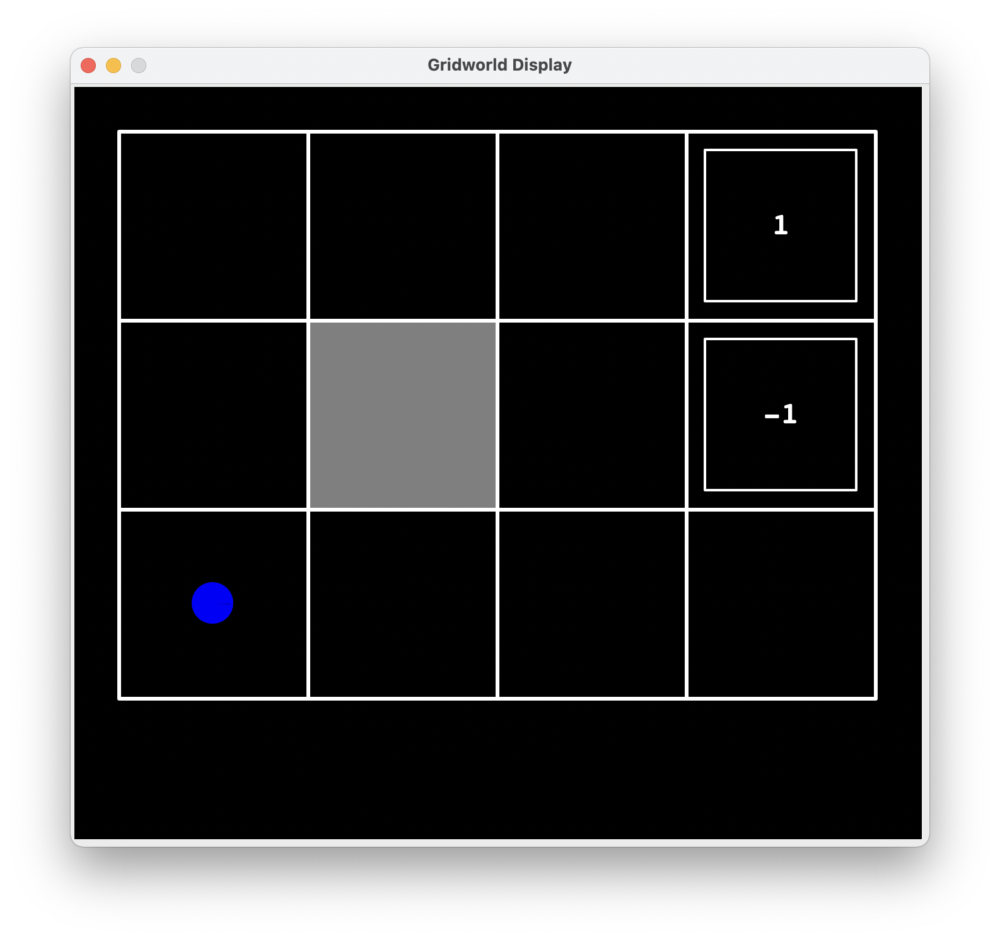
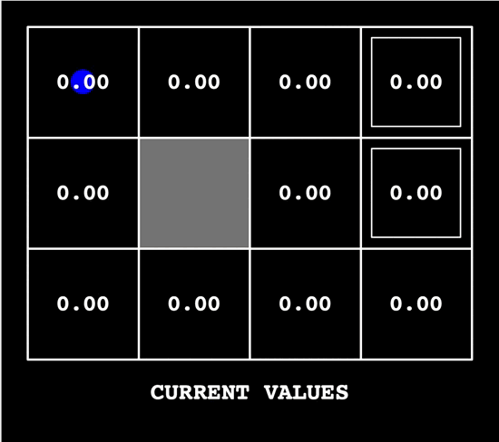
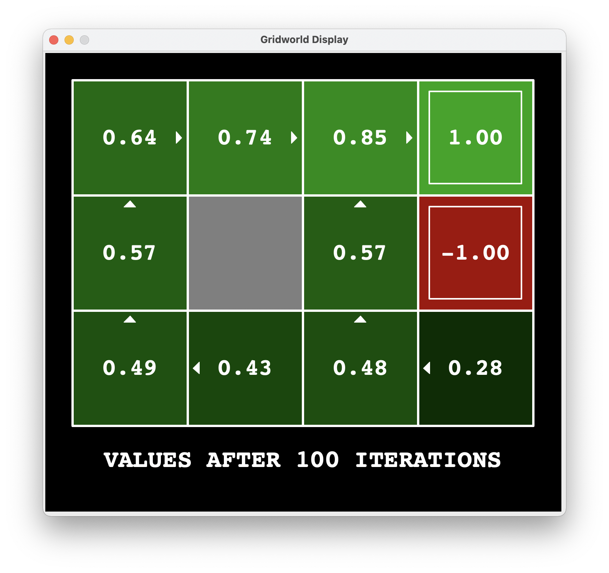
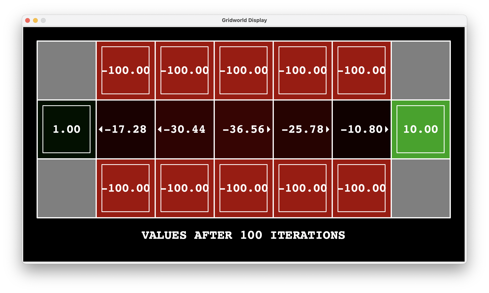
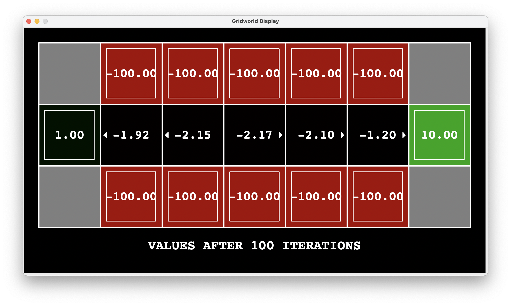
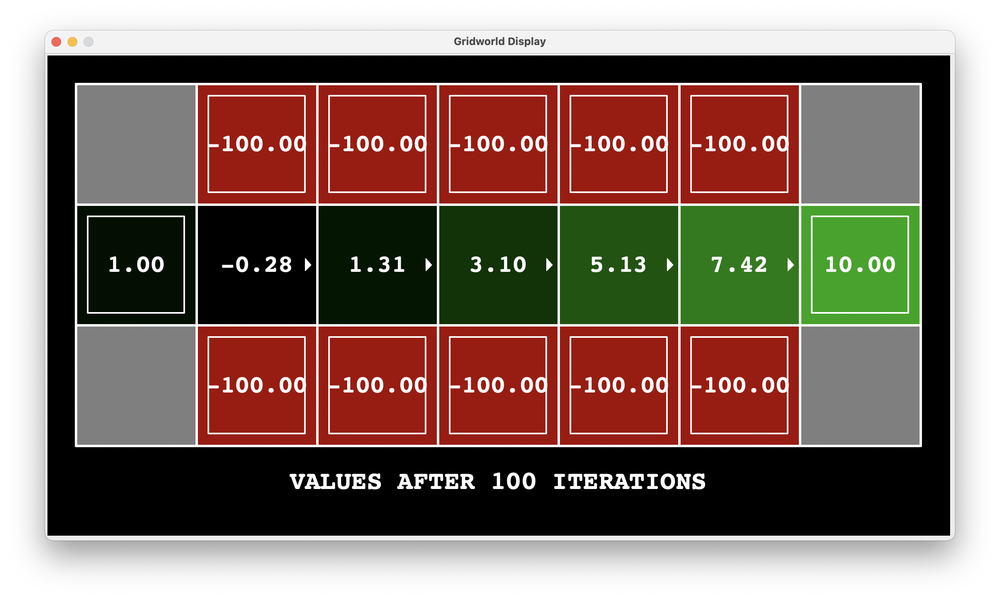
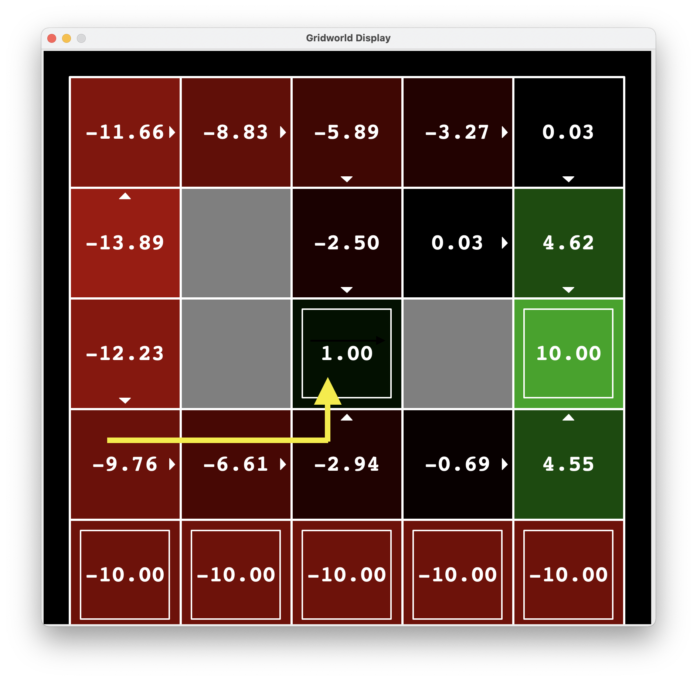
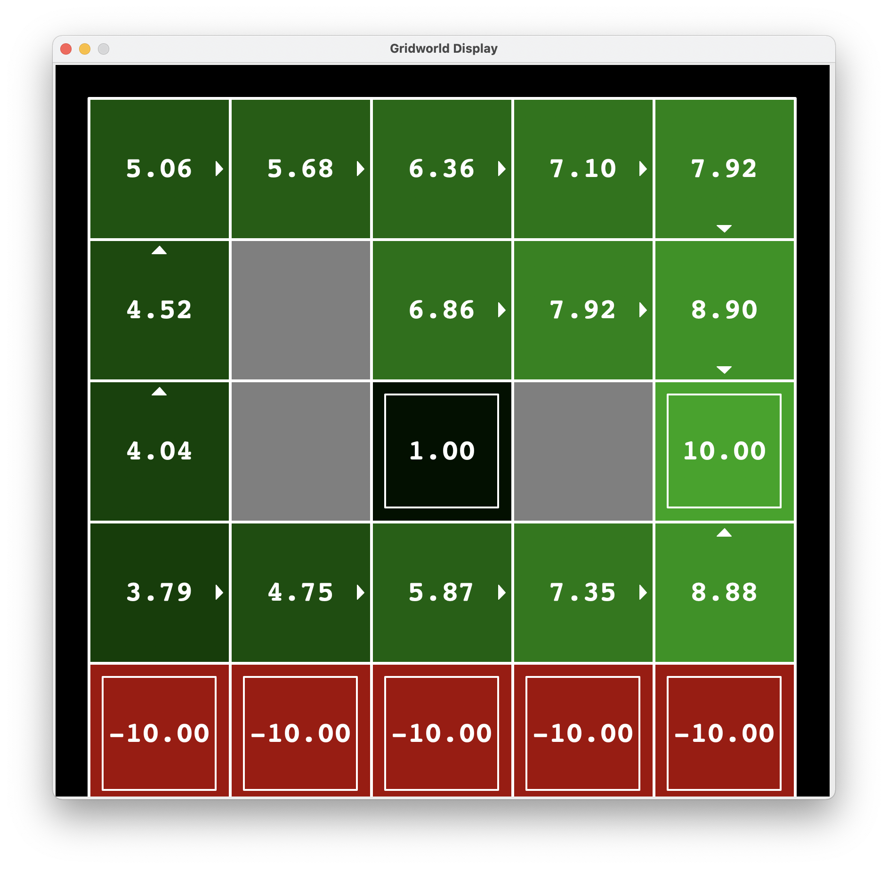
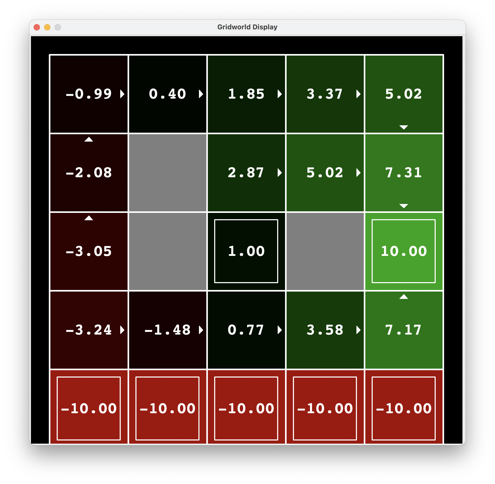
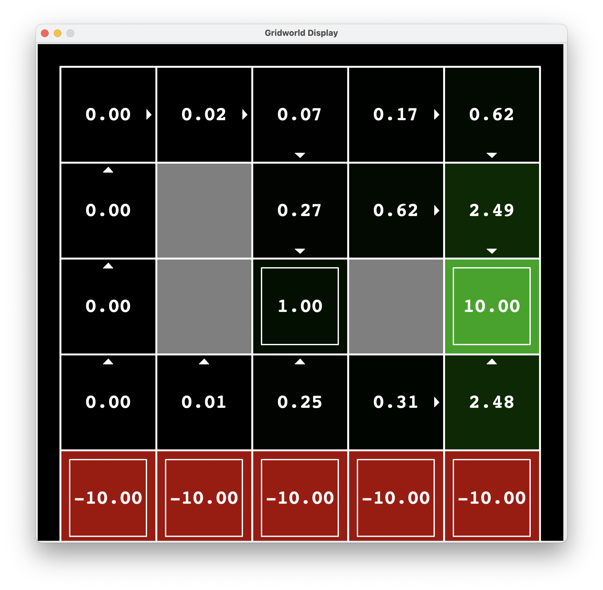

# Planification stochastique et Processus Décisonnels de Markov

L'objectif de ce TP est d'implémenter l'algorithme de planification value iteration et d'étudier l'influence des différents paramètres sur la politique optimale obtenue.


L'implémentation sera effectuée en Python


## 1. Environnement déterministe ou stochastique

Nous lançons le labyrinthe en mode manuel : `python gridworld.py -m`



L'agent est représenté par un cercle bleu, les états absorbants par un carré blanc contenant la valeur de récompense positive ou négative à l'intérieur, les murs sont les cases grises.


#### *Question 1*

Par défaut, la valeur du bruit est de 20%, ce qui signifie que l'agent a 80% de chances de se diriger dans la direction souhaitée, et 20% de chances d'aller à 90 degrés de cette direction (par exemple si l'agent souhaite aller vers le nord, il a 10% de chances d'aller à l'ouest et 10% de chances d'aller à l'est).


Nous constatons ce comportement en mode manuel, lorsque nous déplaçons l'agent avec les flèches de notre clavier.


Lorsque nous modifions le paramètre de bruit à 0 : `python gridworld.py -m --noise 0`,  nous obtenons bien un agent allant constamment dans la direction souhaitée. **Un bruit égal à 0 corrsepond donc à un environnement déterministe, et un bruit supérieur à 0 correspond à un environnement stochastique.**


## 2. Agent aléatoire

Nous exécutons le labyrinthe avec un agent random `python gridworld.py` (random étant l'agent par défaut). Cet agent ne planifie pas, donc la valeur des états est constamment de 0. Nous observons ainsi l'agent se déplacer de façon complètement aléatoire sur la grille, jusqu'à arriver sur l'un des deux états absorbants.




#### *Question 1*

Voici le code proposé pour un agent aléatoire (dans `gridworld.py`) :

```python
class RandomAgent:
def getAction(self, state):
return random.choice(mdp.getPossibleActions(state))

def getValue(self, state):
return 0.0

def getQValue(self, state, action):
return 0.0

def getPolicy(self, state):
"NOTE: 'random' is a special policy value; don't use it in your code."
return "random"

def update(self, state, action, nextState, reward):
pass
```


Sans surprise, nous observons que l'agent choisit son action de façon aléatoire dans la liste des actions possibles, et que les *values* et *q-values* ne sont jamais actualisées, toujours prises égales à 0. 


## 3. Algorithme value iteration

Nous souhaitons désormais implémenter un agent planifiant hors-ligne sa politique grâce à l'algorithme *value iteration* [Bellman, 1957], qui permet de calculer itérativement la fonction de valeur optimale suivant le schéma suivant :


et que l'on répète jusqu'à convergence.


La politique  est extraite à partir de en calculant la politique gloutonne :


#### *Question 1*

Nous complétons d'abord la classe `ValueIterationAgent` (dans le script du même nom) en implémentant les méthodes `__init__` (qui effectue les itérations de l'algorithme), `getValue`, `getQValue`, `getPolicy` et `getAction`.


#### *Question 2*

Nous exécutons l'agent `value` implémenté à l'étape précédente. Nous obtenons les valeurs suivantes :



Nous constatons que ces valeurs ne sont pas les mêmes que celles vues en cours. Cela est dû à une gestion différente des états absorbants par la codebase en python : dans notre cas, l'agent effectue un déplacement (fictif) supplémentaire vers une case `TERMINAL_STATE` contenant la récompense après avoir atteint la case <3,2> ou <3,1>.


## 4. Influence des paramètres

Maintenant que l'algorithme est fonctionnel, nous testons la planification sur d'aures environnements.

### 4.1 BridgeGrid

Nous utilisons d'abord le labyrinthe *BridgeGrid*. Nous effectuons une planification avec les paramètres par défaut dans un premier temps (`noise = 0.2`, ` discount = 0.9`) : `python gridworld.py -a value -g BridgeGrid` et nous obtenons le résultat suivant :



Nous constatons que la politique optimale trouvée ici ne permet pas à l'agent de parcourir le pont. Ce qui est assez logique puisque l'agent n'a pas le droit à l'erreur s'il veut traverser le labyrinthe (un faux mouvement et il se retrouve dans un état absorbant), et les récompenses sont extrêmement négatives dans les états absorbants le long du chemin. L'agent a donc tout intérêt à rester à son point de départ où la récompense est de 1. 


Nous pouvons déjà intuiter que sur les deux paramètres `noise` et `discount`, le second n'a que peu d'influence puisque la différence d'ordre de grandeur entre les récompenses négatives et positives écrase l'importance du paramètre. Le problème réside dans le fait que le robot, qui doit effectuer `RIGHT` 6 fois (dont 5 fois pouvant être fatales) n'a que 0,8^5 = 32,8% de chances de traverser sans tomber. Le paramètre à changer sera donc le `noise`.


#### *Question 1*

Nous modifions d'abord le `discount` à 0,1 en gardant le `noise` par défaut à 0,2.




Nous observons une amélioration dans le sens où les valeurs sont moins négatives, mais la politique optimale reste mauvaise.


Modifions désormais le `noise` en gardant `discount = 0.9` :

Lorsque nous "ajoutons du déterminisme" à l'expérience (*i.e* `noise` -> 0 : le robot a plus de chances d'effectuer l'action désirée), nous obtenons une valeur seuil de `noise` à environ 1,6%, qui donne le résultat suivant :



La politique optimale permet donc à l'agent de traverser le pont pour `noise < 1.6%`  et `discount = 0.9`.

### 4.2 DiscountGrid

Nous exécutons maintenant l'environnement *DiscountGrid*, qui est un labyrinthe présentant deux chemins permettant d'arriver à un état absorbant à récompense positive :

- le premier est court mais risqué (chemin du bas) car proche d'états absorbants à récompenses négatives.
- le second est plus sûr mais plus long (chemin passant par le haut du labyrinthe)


#### *Question 2*

Nous partons des valeurs initiales `discount = 0.9`, `noise = 0.2` et `livingReward = 0`. Nous cherchons à obtenir une politique optimale pour les cas suivants :


1. Chemin risqué pour atteindre l'état absorbant de récompense +1 :

Ici le `noise ` ne semble pas vraiment être le paramètre à changer. Comme l'état absorbant +1 est situé plus près de l'entrée du labyrinthe que le +10, il faut soit que le robot passe le moins de temps possible sur la labyrinthe (ce qui revient à mettre un `livingReward` négatif), soit que le robot ait un comportement "cigale" et ne prenne pas en compte les valeurs éloignées de son état afin de ne pas "voir" l'état absorbant de récompense +10 (`discount` qui tend vers 0). Toutefois, cette seconde option ne fonctionnera pas pour un chemin risqué puisque le malus des récompenses négatives orientera la politique de l'agent vers le chemin sûr dès le début, ce que nous avons vérifié par l'expérience.


Nous testons donc le paramètre `livingReward` pour différentes valeurs négatives, et nous obtenons une politique optimale qui suit un chemin risqué pour aller à l'état absorbant de récompense +1 :




2. Chemin risqué pour atteindre l'état absorbant de récompense +10 :

Pour atteindre l'état absorbant de récompense +10 en passant par le chemin risqué, le robot doit pouvoir "voir" la récompense au bout, changer le `discount` n'aurait donc pas beaucoup d'effet : nous le laissons à 0,9. Nous pourrions diminuer le `noise` mais nous nous retrouvons dans une situation similaire à la partie *BridgeGrid*, ainsi, nous obtenons une politique optimale satisfaisante pour un `noise` de 7% :



Nous pouvons également modifier la `livingReward` à -1 ce qui donne le résultat suivant :




3. Chemin sûr pour atteindre l'état absorbant de récompense +1

Ici, nous devons faire en sorte que le robot ne prenne pas en compte l'état absorbant de récompense +10 pour arriver à celui de récompense  -1. Nous devons donc changer le `discount` que nous avons trouvé optimal pour une valeur de 0,3.




4. Chemin évitant les états absorbants

Pour que le robot prenne ce chemin, il faut qu'il soit récompensé pour ne prendre aucun risque, et ne pas arriver à un état absorbant positif. Autrement dit, il faut qu'il soit récompensé pour rester en vie. C'est exactement le but de `livingReward` que nous fixons à 2 :


## Conclusion

Grâce à ce TP nous avons pu implémenter les briques essentielles à la résolution d'un problème de planification sous incertitudes au moyen d'un modèle MDP. Nous y avons notamment implémenté l'algorithme *value iteration* permettant de converger vers une solution de l'équation d'optimalité de Bellman et ainsi de trouver la politique optimale en fonction des paramètres. Nous avons également étudié l'influence de ces paramètres et les avons ajustés afin d'obtenir des politiques optimales dans plusieurs situations.
