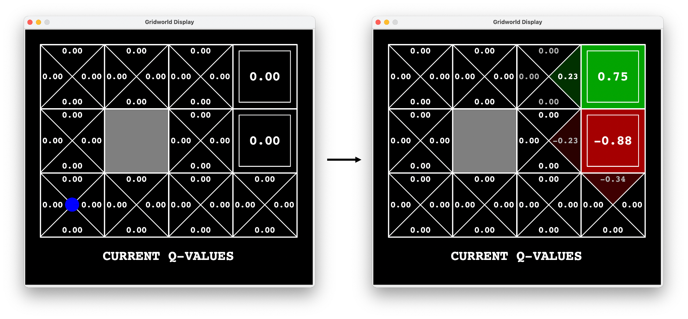
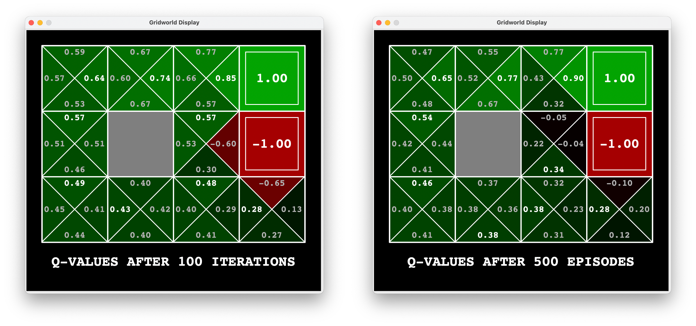
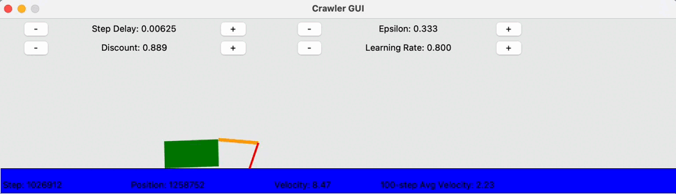
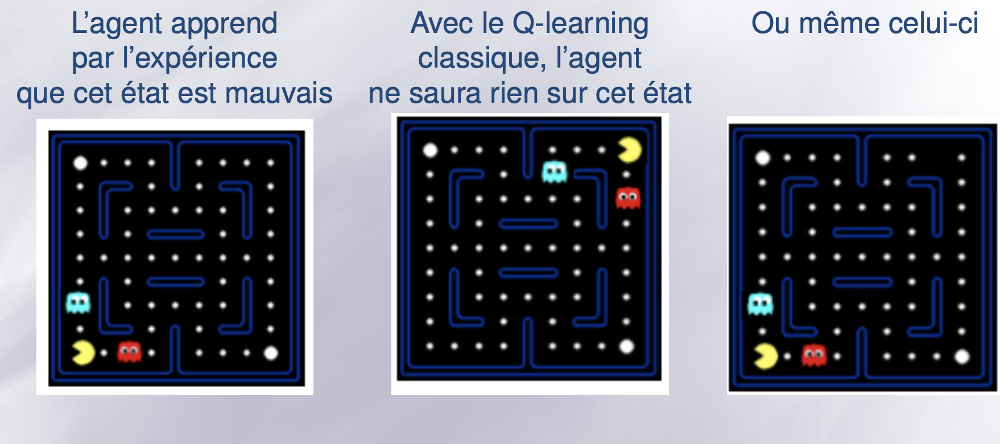
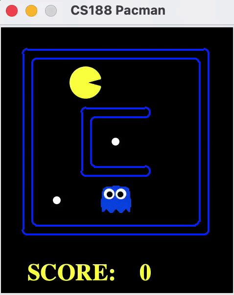
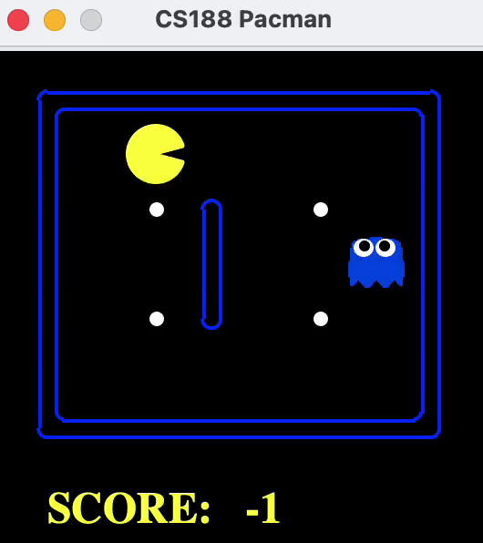
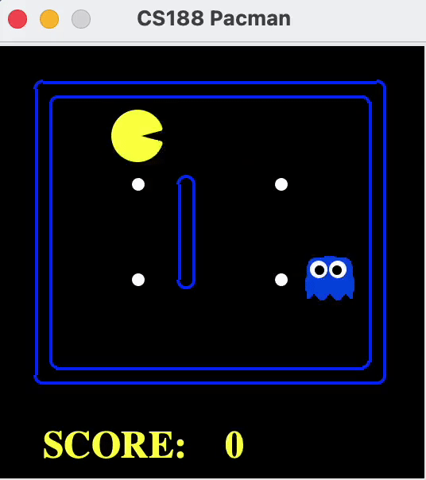
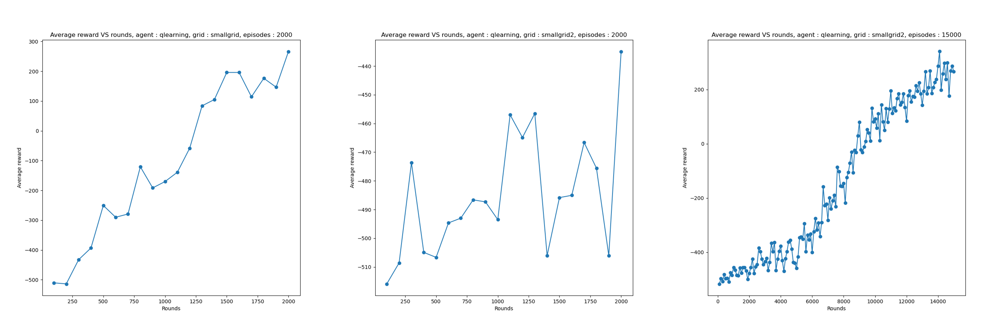
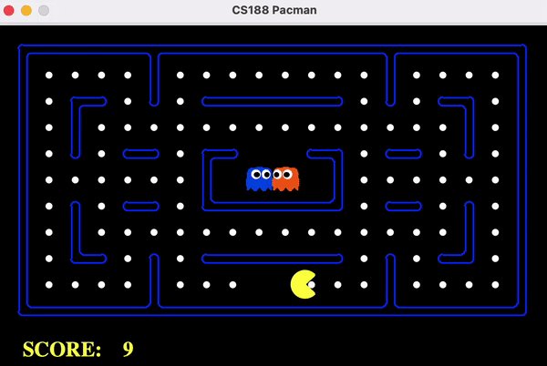
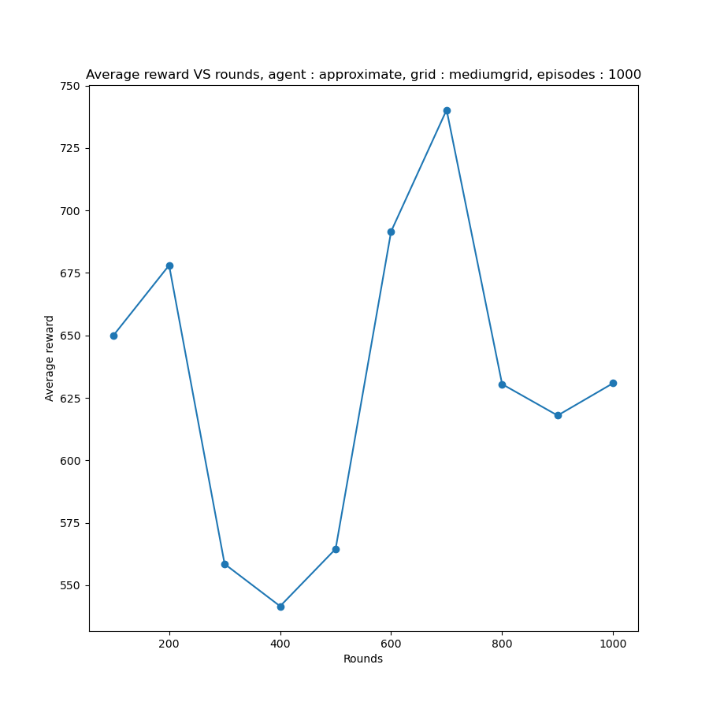

# Apprentissage par renforcement

L’objectif du TP est d’implémenter et de tester dans différents environnements un algorithme d’apprentissage par renforcement : le Q-learning.

L'implémentation sera effectuée en Python.

## 1. Agent Q-Learning tabulaire

### 1.1. Agent avec exploration manuelle

#### *Questions 1, 2*
Nous allons d'abord tester l'agent avec une exploration manuelle, afin d'observer l'actualisation des Q-valeurs.
Nous complétons la classe `QLearningAgent` (notamment les méthodes `__init__, getQValue, getValue, getPolicy`) afin d'actualiser les Q-valeurs sur les cases. Nous exécutons l'agent avec la commande `python gridworld.py -a q -m -k 5`.

### 1.2. Agent avec stratégie d'exploration
Nous allons désormais implémenter la stratégie *greedy* de l'agent dans `getAction`. L'idée ici est d'avoir une politique qui n'est plus figée, car l'agent la modifie par essai/erreur. L'agent va donc à chaque état choisir l'action de plus grande valeur avec une probabilité `1 - epsilon` (exploitation), et choisir une action au hasard avec une probabilité `epsilon` (exploration).

Nous prenons ici `epsilon = 0.3`.

`python gridworld.py -a q -k 500`

Nous pouvons comparer la politique (les Q-valeurs) obtenue par stratégie *epsilon-greedy* (à droite) après 500 épisodes de l'agent à celle obtenue lors de la planification par MDP (à gauche) après 100 épisodes de value iteration. Nous observons que les ordres de grandeur sont sensiblement similaires pour un nombre suffisant d'itérations. Nous observons cependant des différences notamment au niveau de l'état absorbant de récompense -1 puisque l'agent, malgré les phases d'exploration, suivra la politique optimale 70% du temps.

### 1.3. Nouvel environnement : le robot "crawler"

On considère maintenant un robot composé d’un bras en deux parties. La partie haute du bras possède 4 positions possibles, et la partie basse 6 positions. 4 actions sont possibles correspondant au fait de monter ou descendre d’une position l’une des deux parties du bras. La récompense de l'agent est définie comme la distance parcourue entre deux pasd de temps.

Nous exécutons le crawler afin d'observer l'apprentissage : `python crawler.py`

Nous avons la possibilité de modifier en temps réel les différents paramètres d'apprentissage : `discount, epsilon, learning rate`. Nous constatons par exemple qu'augmenter epsilon au début de l'apprentissage permet au robot de mieux cerner son environnement, et en le baissant au fur et à mesure, il suit de plus en plus précisément la politique optimale déterminée.

## 2. Jouons à Pac-Man

On souhaite maintenant avoir un agent qui apprend par renforcement à jouer au jeu de Pacman.

### 2.1. Jeu Pac-Man

Nous testons dans un premier temps notre performance sur Pac-Man `python pacman.py -l smallClassic`.

Force est de constater que nous sommes assez mauvais.

### 2.2. Q-Learning tabulaire pour le jeu Pacman : comment définir les états du MDP ?

Ici, les états du MDP sont déjà définis dans la classe `GameStateData` du fichier `game.py`. Les attributs d'un état sont :
 - `food` : une grille de la taille du layout où sont stockées les positions de chaque pac-gommes. 
 - `capsules` : une grille de la taille du layout où sont stockées les positions de chaque pac-dot. 
 - `agentStates` : une liste d'objets agentState qui, pour chaque agent présent dans la partie (fantômes et pac-man) contient la position, la direction, et le `scaredTimer` si l'agent est un fantôme et que pacman a mangé une capsule.
 - `score` : le score courant du joueur.
  
Pour créer la table des q-valeurs de dimension `nb_etats * nb_actions`, le code utilise un objet de type `counter`. Cet objet est un dictionnaire particulier qui, lorsqu'il est appelé avec un couple (état, action) inexistant, ne renvoie pas d'erreur (renvoie 0).
Pour cela, le dictionnaire cherche si le couple (état, action) a déjà été appelé.
Pour ce faire, un test `state == other_state` est effectué. Le test d'égalité de ces objets est défini dans la méthode `GameState.__eq__`. Cette méthode vérifie que l'ensemble des attributs susmentionnés sont égaux. Nous concluons que deux états similaires sont considérés comme différents ici, rendant la table des q-valeurs inutilement grande comme le montre la slide 77 du cours RL :

 

Une manière de compresser ces états serait d'abord de comparer des positions relatives plutôt que des positions absolues. Nous pouvons prendre en compte uniquement la position de pacman, la distance entre pacman et le fantôme le plus proche (ou les deux fantômes les plus proches), leur direction, la position relative du pac-gomme le plus proche par rapport à Pac-Man.

Toutefois, nous ne pouvons pas le faire ici, cela impliquerait de modifier la codebase en profondeur pour des résultats non-garantis.

Nous testons le `PacmanQAgent` sur les layouts `smallGrid` et `smallGrid2` afin d'évaluer la performance du Q-learning, avec les paramètres `epsilon=0.05`, `gamma=0.8`, `alpha=0.2` :

`python pacman.py -p PacmanQAgent -x 2000 -n 2010 -l smallGrid`

L'agent se débrouille correctement sur cette grille simpliste pour 2000 épisodes d'entraînement.

`python pacman.py -p PacmanQAgent -x 2000 -n 2010 -l smallGrid2`

Nous observons ici que 2000 épisodes d'entraînement ne sont pas suffisants pour que Pacman adopte une politique gagnante, alors que la grille n'est pas beaucoup plus complexe. Ceci montre que le simple fait d'ajouter 1 pac-gomme, deux colonnes et de retirer 2 murs modifie drastiquement les performances d'apprentissage.

`python pacman.py -p PacmanQAgent -x 15000 -n 15010 -l smallGrid`

Nous réitérons avec 15000 épisodes d'entraînement pour `smallGrid2`. Nous observons cette fois-ci une politique plus satisfaisante, mais l'entraînement sur des grilles plus complexes semble compliqué dans des temps raisonnables.

Nous traçons ici les courbes d'apprentissage des 3 expériences :

### 2.3. Q-Learning et généralisation pour le jeu Pacman

Dans cette partie, l’objectif est d’améliorer les capacités de généralisation entre états du Q-Learning, en utilisant une fonction d’approximation pour approximer la fonction Q. 

Nious définissons des features qui permettent de calculer Q en effectuant la combinaison linéaire. Pour cela, nous implémentons la classe `ApproximateQAgent` de `qlearningAgents.py`, ainsi que la classe `SimpleExtractor` de `featureExtractors.py`.

Les features sélectionnées sont les suivantes :
- `bias` 
- `nb_ghosts_next_step`  : nombre de fantômes qui peuvent atteindre en un pas la position
future du pacman (position atteinte par le pacman lorsqu’il fait a dans s)
- `food_next_step`  : présence d’un pac-dot à la position future du pacman (position
atteinte par le pacman lorsqu’il fait a dans s)
- `food_distance` 

Avec *dist* la distance au plus proche pac-dot depuis la position future du
pacman (position atteinte par le pacman lorsqu’il fait a dans s).

Nous testons l'agent sur la grille `smallGrid` et `smallGrid2` pour 50 épisodes d'entraînement (contre 2000 dans la partie précédente) et nous constatons que ceux-ci apprennent plutôt bien. Nous observons parfois que la descente de gradient atteint un minimum local, ce qui donne à l'agent des comportements assez statiques (il apprend juste à esquiver les fantômes).

`python pacman.py -p ApproximateQAgent -a extractor=SimpleExtractor -x 50 -n 60 -l mediumGrid`

Nous testons ensuite notre agent sur la grille `mediumGrid` pour 1000 épisodes d'entraînement.

`python pacman.py -p ApproximateQAgent -a extractor=SimpleExtractor -x 1000 -n 1010 -l mediumGrid`

Nous observons de très bonnes performances (bien meilleur que nous) avec les features définies plus haut.

Nious traçons ici la courbe d'apprentissage de l'agent :

## Conclusion

Ce projet a été l'occasion de mettre en oeuvre le reinforcement learning dans un contexte ludique. Nous avons pu apprendre que sauf situation extrêmement simpliste, l'algorithme du Q-learning ne peut être appliqué pour apprendre naïvement à partir d'états bruts. Nous avons vu que le Q-Learning approximé permet justement d'apprendre des modèles très performants, en utilisant une représentation plus compacte des états et en reconstituant la fonction de QValue à partir de features relativement simples.
